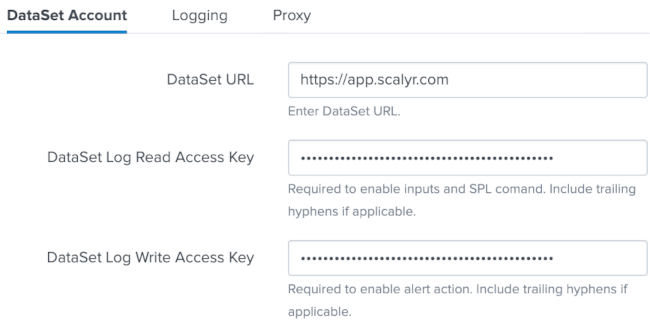
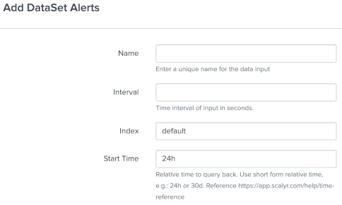
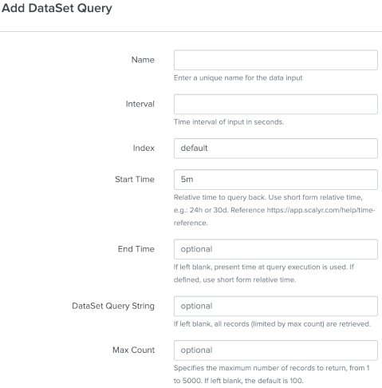

#  DataSet Add-on for Splunk
The DataSet Add-on for Splunk provides integration with [DataSet](https://www.dataset.com) by [SentinelOne](https://sentinelone.com). The key functions allow two-way integration:
- SPL custom command to query DataSet directly from the Splunk UI without having to reindex data to Splunk.
- Inputs to index alerts as CIM-compliant, or user-defined query results, from DataSet to Splunk.
- Alert action to send events from Splunk to DataSet.

## Installation
The included .tgz file is ready for installation in Splunk. The package subdirectory contains all artifacts. To compile, reference Splunk's [UCC Framework instructions](https://splunk.github.io/addonfactory-ucc-generator/how_to_use/) to use `ucc-gen` and `slim package`.

Reference Splunk documentation for [installing add-ons](https://docs.splunk.com/Documentation/AddOns/released/Overview/Installingadd-ons).

### Splunk Enterprise
| Splunk component | Required | Comments |
| ------ | ------ | ------ |
| Search heads | Yes | Required to use the custom search command. |
| Indexers | No | Parsing is performed during data collection. | 
| Forwarders | Yes | For distributed deployments, this add-on requires heavy forwarders for modular inputs. |

### Splunk Cloud
| Splunk component | Required | Comments |
| ------ | ------ | ------ |
| Search heads | Yes | Required to use the custom search command. Splunk Cloud Victoria Experience also handles modular inputs on the search heads. |
| Indexers | No | Parsing is performed during data collection. | 
| Inputs Data Manager | Yes | For Splunk Cloud Classic Experience, this add-on requires an IDM for modular inputs. |

## Configuration
### Dataset
1. Navigate to https://app.scalyr.com/keys


2. Click Add Key > Add Read Key (required for inputs and search command).
3. Click Add Key > Add Write Key (required for alert action).
4. Optionally, click the pencil icon to rename the keys.

### Splunk
1. In Splunk, open the Add-on



2. In configuration on DataSet Account tab:
- Select the environment.
- Enter the DataSet read key.
- Enter the DataSet write key.

3. Optionally, configure logging level and proxy information on the associated tabs.
4. Click Save.


5. On the inputs page, click Create New Input and select the desired input



6. For DataSet alerts, enter:
- A name for the input.
- Interval, in seconds. A good starting point is `300` seconds to collect every five mintues.
- Splunk index name
- Start time, in relative shorthand form, e.g.: `24h` for 24 hours before input execution time.
7. Click Save.



7. For DataSet queries, enter:
- A name for the input.
- Interval, in seconds. A good starting point is `300` seconds to collect every five mintues.
- Splunk index name
- Start time, in relative shorthand form, e.g.: `24h` for 24 hours before input execution time.
- *(optional)* End time, in relative shorthand form, e.g.: `5m` for 5 minutes before input execution time.
- *(optional)* Query string used to return matching events.
- *(optional)* Maximum number of events to return.

## Using

### Inputs
The DataSet Add-on for Splunk collects the following inputs utilizing time-based checkpointing to prevent reindexing the same data:

| Source Type | Description | CIM Data Model |
| ------ | ------ | ------ |
| dataset:alerts | Predefined Power Query API call to index [alert state change records](https://app.scalyr.com/help/alerts#logging)  | [Alerts](https://docs.splunk.com/Documentation/CIM/latest/User/Alerts) |
| dataset:query | User-defined standard [query](https://app.scalyr.com/help/api#query) API call to index events | - |

## SPL Command
The `| dataset` command allows queries against the DataSet API directly from Splunk's search bar. Optional parameters are supported:

- **method** - Define `query`, `powerquery` or `timeseries` to call the appropriate REST endpoint. Default is query.
- **query** - The DataSet [query](https://app.scalyr.com/help/query-language) or filter used to select events. Default is no filter (return all events limited by maxCount).
- **starttime** - The Splunk time picker can be used (not "All Time"), but if starttime is defined it will take precedence to define the [start time](https://app.scalyr.com/help/time-reference) for DataSet events to return. Use epoch time or relative shorthand in the form of a number followed by d, h, m or s (for days, hours, minutes or seconds), e.g.: `24h`. Default is 24h.
- **endtime** - The Splunk time picker can be used (not "All Time"), but if endtime is defined it will take precedence to define the [end time](https://app.scalyr.com/help/time-reference) for DataSet events to return. Use epoch time or relative shorthand in the form of a number followed by d, h, m or s (for days, hours, minutes or seconds), e.g.: `5m`. Default is current time at search.

For query and powerquery, additional parameter include:
- **maxcount** - Number of events to return.
- **columns** - Specified fields to return from DataSet query (or powerquery, analogous to using `| columns` in a powerquery). Yields performance gains for high volume queries instead of returning and merging all fields.

For timeseries, additional parameters include:
- **function** - Define value to compute from matching events. Default is rate.
- **buckets** - The number of numeric values to return by dividing time range into equal slices. Default is 1.
- **createsummaries** - Specify whether to create summaries to automatically update on ingestion pipeline. Default is true, *be sure to set to false for one-off or while testing new queries*.
- **useonlysummaries** - Specify whether to only use preexisting timeseries for fastest speed.

For all queries, be sure to `"`wrap the entire query in double quotes`"`, and inside use `'`single quotes`'` or double quotes `\"`escaped with a backslash`\"`, as shown in the following examples.

Query Example:
`| dataset method=query search="serverHost = * AND Action = 'allow'" maxcount=50 starttime=10m endtime=1m`

Power Query Example 1: `| dataset method=powerquery search="dataset = \"accesslog\"
| group requests = count(), errors = count(status == 404) by uriPath
| let rate = errors / requests
| filter rate > 0.01
| sort -rate"`


Power Query Example 2: `| dataset method=powerQuery search="$serverHost == 'cloudWatchLogs' 
| parse 'RequestId: $RID$ Duration: $DUR$ ms Billed Duration: $BDUR$ ms Memory Size: $MEM$ MB Max Memory Used: $UMEM$ MB' 
| let deltaDUR= BDUR - DUR, deltaMEM = MEM - UMEM 
| sort -DUR 
| columns 'Request ID' = RID, 'Duration(ms)' = DUR, 'Charged delta (ms)' = deltaDUR, 'Used Memory (MB)' = UMEM, 'Charged delta Memory (MB)' = deltaMEM" starttime=5m`

Since events are returned in JSON format, the Splunk [spath command](https://docs.splunk.com/Documentation/SplunkCloud/latest/SearchReference/Spath) is useful. Additionally, the Splunk [collect command](https://docs.splunk.com/Documentation/Splunk/latest/SearchReference/collect) can be used to add the events to a summary index:

```
| dataset query="serverHost = * AND Action = 'allow'" maxcount=50 starttime=10m endtime=1m
| spath
| collect index=dataset
```

Timeseries Query Example:
```
| dataset method=timeseries search="serverHost='scalyr-metalog'" function="p90(delayMedian)" starttime="24h" buckets=24 createsummaries=false onlyusesummaries=false
```

## Alert Action
An alert action allows sending an event to the DataSet [addEvents API](https://app.scalyr.com/help/api#addEvents). 

## Support
For support, please open an issue on GitHub.

##### Note
This add-on was built with the [Splunk Add-on UCC framework](https://splunk.github.io/addonfactory-ucc-generator/).
Splunk is a trademark or registered trademark of Splunk Inc. in the United States and other countries.